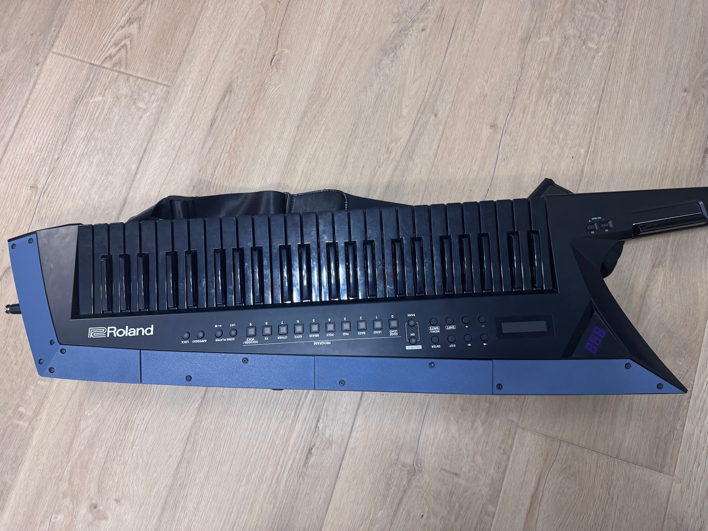

# AX-Edge Blade

A customizable and 3D-printable blade compatible for the Roland AX-Edge Keytar. The original blade was scanned in with a Faro scanner, then reverse engineered to produce a version that is easier to 3D print.

The long side has been made flat on top so it can be printed face down on the build plate. This allows for graphics to be inserted on that plane with color changes on a single-head printer (I use a Bambu P2S) without a huge purge tower. The short side is unfortunately too curved and must be printed vertically. It could probably be printed horizontally with supports in the right places but I haven't been able to dial that in yet.

I split the body into 5 pieces for printing on a 256x256mm build plate, then added tabs to keep the edges that are far from screw mounts aligned. If you want the complete, unsplit version, use the STL or roll the timeline back 14 steps in fusion. To move the split lines, adjust the Split1/2/3 parameters.

WIP, there are still a few issues like:
- screw holes are not exactly perfect
- I haven't dialed in supports for the short side so about 50% of my attempts to print it result in it falling over and spaghettiing 
- There's a weird raised oval that appears on the short side, no idea what causes it but I will need to figure this out sometime

I will update the files as these issues are fixed, and PRs are welcome!

## Files

- **AxEdgeBlade.f3d** Fusion file
- **AxEdgeBlade.stl** STL of the entire blade
- **Export_\*.3mf** Split pieces for 3D printing on a 256x256mm build plate
- **FaroScan.stl** The scan of the original blade. Very imperfect as the scanner isn't designed to work with an object as long as this blade, but it was good enough to use as a template for rebuilding it.

## Support this project

If you like this design, please consider downloading it from MakerWorld to support me **(I will add a link once I figure out the short part falling over issue)**

Downloads there help me earn points and keep making more designs 🙌

## Licensing crap

This is an unofficial blade design for the Roland AX-Edge keytar. Not affiliated with or endorsed by Roland.

Licensed under CC BY 4.0:
https://creativecommons.org/licenses/by/4.0/

You are free to use, modify, and sell prints of this design,
as long as you provide attribution.